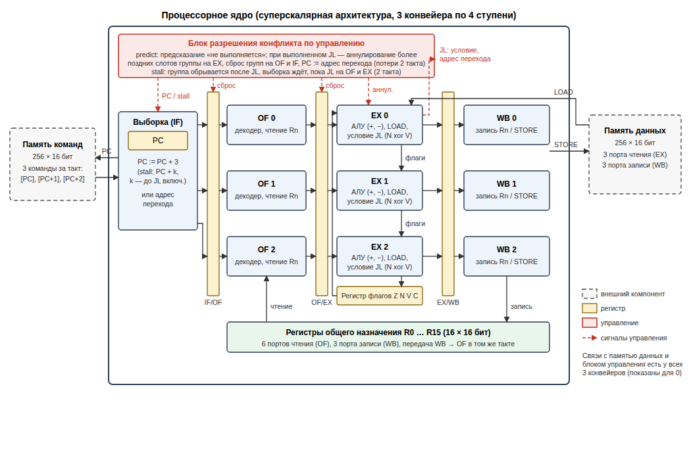

# Лабораторная работа 2. Модель элементарной параллельной вычислительной системы

## 1. Постановка задачи, вариант задания

Разработать RTL-модель процессорного ядра с суперскалярной архитектурой, включающей
несколько конвейеров, на языке VHDL, тестовое окружение и набор тестов.

**Вариант 7:**

| Количество конвейеров | Регистров общего назначения | Команды | Тип конфликта |
|:---:|:---:|---|---|
| 3 | 16 | Load, Store, +, −, условный переход по «<» | **конфликт по управлению** |

Общие требования методических указаний:

* конвейер из четырёх ступеней: выборка команды, выборка операнда, вычисление результата,
  запись результата;
* специализированные регистры: программный счётчик и регистр флагов;
* арифметические команды: `код, операнд1, операнд2`, операнды в регистрах
  (указываются номера регистров), результат записывается в регистр операнда1;
* Load/Store: регистровая адресация памяти данных (адрес — в регистре операнда2);
* условный переход: непосредственная адресация (адрес в памяти команд записан в команде);
* все команды выполняются за один такт на каждой ступени;
* разрабатывается и реализуется алгоритм устранения конфликта заданного типа (по
  управлению); остальные типы конфликтов не рассматриваются — тесты составлены так,
  чтобы их не возникало.

Среда: GHDL 4.1 (VHDL-2008). Модель также компилируется в ModelSim/Questa (`vcom -2008`).

### Состав проекта

| Путь | Содержимое |
|------|------------|
| [`rtl/cpu_pkg.vhd`](rtl/cpu_pkg.vhd) | типы, коды операций, конвейерные регистры, АЛУ |
| [`rtl/cpu_core.vhd`](rtl/cpu_core.vhd) | процессорное ядро: 3 конвейера, регистры, блок разрешения конфликта |
| [`rtl/imem.vhd`](rtl/imem.vhd), [`rtl/dmem.vhd`](rtl/dmem.vhd) | память команд и память данных (внешние по отношению к ядру) |
| [`rtl/mem_init_pkg.vhd`](rtl/mem_init_pkg.vhd) | загрузка образов памяти из файлов |
| [`rtl/cpu_system.vhd`](rtl/cpu_system.vhd) | верхний уровень: ядро + память команд + память данных |
| [`tb/tb_cpu.vhd`](tb/tb_cpu.vhd) | тестовое окружение |
| [`tests/*.asm`](tests) | тесты на языке ассемблера |
| [`tests/build/`](tests/build) | образы памяти команд, памяти данных (до и после), листинги |
| [`tools/asm.py`](tools/asm.py) | ассемблер + эталонная модель + модель времени |
| [`tools/mutation_test.py`](tools/mutation_test.py) | оценка полноты тестирования (мутационный анализ) |
| [`tools/report_tests.py`](tools/report_tests.py) | формирование [`docs/tests.md`](docs/tests.md) |
| [`run_tests.sh`](run_tests.sh) | сборка модели и прогон всех тестов в двух режимах |
| [`results/`](results) | результаты моделирования: итоговые образы памяти, журналы, потактовые трассы |
| [`docs/tests.md`](docs/tests.md) | приложение: программы и образы памяти всех тестов |

Запуск:

```bash
./run_tests.sh                 # все тесты, оба режима
./run_tests.sh t3_jl_taken     # один тест + временные диаграммы results/*.vcd (GTKWave)
python3 tools/mutation_test.py # оценка полноты тестирования
python3 tools/report_tests.py  # обновить docs/tests.md
```

Готовые образы памяти лежат в `tests/build/`, поэтому для моделирования Python не
обязателен — нужен только симулятор VHDL. В ModelSim:

```
vlib work
vcom -2008 rtl/cpu_pkg.vhd rtl/mem_init_pkg.vhd rtl/imem.vhd rtl/dmem.vhd rtl/cpu_core.vhd rtl/cpu_system.vhd tb/tb_cpu.vhd
vsim -gTEST_NAME=t3_jl_taken -gPREDICT_NOT_TAKEN=true tb_cpu
run -all
```

## 2. Структурная схема процессорного ядра



(векторный вариант: [`docs/structure.svg`](docs/structure.svg))

* **Выборка (IF).** Программный счётчик PC. Память команд за один такт выдаёт три команды
  с адресов PC, PC+1, PC+2 — по одной в каждый конвейер (слот 0 — самая ранняя команда
  группы, слот 2 — самая поздняя). Затем PC := PC+3 (в режиме stall — PC+k, где k — длина
  группы, оборванной после JL) или адрес перехода.
* **Выборка операнда (OF).** Декодирование, чтение регистров общего назначения
  (6 портов чтения — по 2 на конвейер). Значения, которые в этом же такте записываются
  на ступени WB, передаются сразу (запись в первой половине такта).
* **Вычисление результата (EX).** Сложение/вычитание с формированием флагов, чтение памяти
  данных (LOAD), вычисление условия перехода JL. Слоты обрабатываются в программном
  порядке, флаги передаются по цепочке 0 → 1 → 2 и в конце такта записываются в регистр
  флагов.
* **Запись результата (WB).** Запись в регистры (3 порта записи) и в память данных
  (STORE, 3 порта записи). При записи в один адрес в одном такте приоритет у более
  позднего слота.
* **Блок разрешения конфликта по управлению** — см. раздел 4.
* **Регистр флагов**: Z (ноль), N (знак), V (переполнение), C (перенос/заём).
  Флаги меняют только ADD и SUB.
* **Память команд** и **память данных** — внешние компоненты (256 слов × 16 бит).

## 3. Формат и кодировка команд

Команда — 16 бит, данные — 16 бит (дополнительный код), адреса памяти команд и данных — 8 бит.

```
 15      12 11       8 7        4 3        0
+----------+----------+----------+----------+
|   код    | операнд1 | операнд2 |   0000   |   ADD, SUB, LOAD, STORE
+----------+----------+----------+----------+
|   код    |   0000   |  адрес перехода     |   JL
+----------+----------+---------------------+
```

| Мнемоника | Код | Операнд1 (11..8) | Операнд2 (7..4) | Действие | Флаги |
|---|:---:|---|---|---|:---:|
| `NOP` | `0000` | — | — | нет операции | — |
| `LOAD Rd, (Ra)` | `0001` | Rd — приёмник | Ra — адрес | Rd := DM[Ra] | — |
| `STORE Rs, (Ra)` | `0010` | Rs — источник | Ra — адрес | DM[Ra] := Rs | — |
| `ADD Rd, Rs` | `0011` | Rd | Rs | Rd := Rd + Rs | Z N V C |
| `SUB Rd, Rs` | `0100` | Rd | Rs | Rd := Rd − Rs | Z N V C |
| `JL addr` | `0101` | — | биты 7..0 — адрес | если «<»: PC := addr | — |
| `HALT` | `1111` | — | — | останов (служебная) | — |

`NOP` и `HALT` — служебные команды, не входящие в набор варианта: `NOP` нужен для
разнесения зависимых команд (конфликты по данным исключаются составом теста), `HALT` —
чтобы тестовое окружение знало момент окончания теста.

Условие «<» — знаковое «меньше» по флагам последней выполненной команды ADD/SUB:
**N xor V**. После `SUB Ra, Rb` оно истинно, если Ra < Rb (с учётом возможного
переполнения). Например, `-30000 − 30000` даёт 5536 (N=0, V=1): «<» истинно, хотя
результат положителен.

Примеры кодирования: `LOAD R1, (R0)` = `1100h`, `ADD R2, R1` = `3210h`,
`SUB R4, R5` = `4450h`, `STORE R7, (R8)` = `2780h`, `JL 51` = `5033h`, `HALT` = `F000h`.

Непосредственных операндов в наборе команд нет, регистры после сброса равны 0, поэтому
тесты получают константы и адреса загрузкой из памяти данных: `LOAD R1, (R0)` загружает
DM[0] = 1, далее адреса строятся сложением.

## 4. Алгоритм устранения конфликта по управлению

### Суть конфликта

Условие перехода становится известно только на ступени EX. К этому моменту на ступенях OF
и IF уже находятся две следующие группы команд (6 команд), а в группе с переходом могут
быть более поздние команды (до 2). Если переход выполняется, все эти команды относятся к
неверному пути и не должны изменить состояние процессора.

### Реализованный алгоритм (режим `predict`, по умолчанию)

Статическое предсказание «переход не выполняется» со спекулятивной выборкой и
аннулированием команд неверного пути:

1. Выборка всегда продолжается с PC+3, как будто перехода нет.
2. На ступени EX слоты обрабатываются по порядку. Для JL вычисляется условие по флагам
   с учётом более ранних команд своей группы (передача флагов внутри ступени EX).
3. Если условие ложно — ничего не происходит, **потерь нет**.
4. Если условие истинно (в такте, когда JL на EX):
   * более поздние слоты группы на EX аннулируются (не попадают на WB и не меняют флаги);
   * группа на ступени OF сбрасывается (в OF/EX записывается «пузырь»);
   * группа, выбираемая в этом такте (IF), не записывается в IF/OF;
   * PC := адрес перехода; со следующего такта выборка идёт по верному пути.
   **Потери — 2 такта.**
5. Команды неверного пути не успевают изменить состояние: регистры и память меняются на
   WB, флаги — в конце EX, а до этих ступеней такие команды не доходят.

Фрагмент ступени EX (`rtl/cpu_core.vhd`):

```vhdl
f := flags;
kill := false; redirect := false; stop := false;
for s in 0 to NPIPE-1 loop
    wb_n(s) := WB_BUBBLE;
    if of_ex(s).valid = '1' then
        if kill then
            ...                                  -- аннулирование более поздних слотов
        else
            wb_n(s).valid := '1'; ...
            case op is
                when OP_ADD | OP_SUB =>
                    alu(op, of_ex(s).a, of_ex(s).b, res, fl);
                    wb_n(s).result := res;
                    f := fl;                     -- флаги для следующих слотов
                when OP_JL =>
                    if is_less(f) then           -- N xor V
                        kill := true; redirect := true;
                        new_pc := of_ex(s).target;
                    end if;
                ...
            end case;
        end if;
    end if;
end loop;
flags <= f;
```

Ступени OF и IF при `redirect` сбрасывают свои группы, в PC записывается `new_pc`.

### Альтернативный алгоритм (режим `stall`, `PREDICT_NOT_TAKEN => false`)

Для сравнения реализован и более простой алгоритм — приостановка выборки:

1. Группа обрывается сразу после команды JL (следующие за ней команды в группу не
   выбираются, PC := PC + номер слота JL + 1).
2. Пока JL находится на ступенях OF и EX, выборка не производится.
3. После вычисления условия выборка продолжается с PC (переход не выполняется) или с
   адреса перехода.

Команды неверного пути никогда не выбираются, но **потери — 2 такта на каждый JL**,
независимо от того, выполняется переход или нет.

### Временные диаграммы

Фрагменты потактовых трасс теста 3 (`results/t3_jl_taken.*.trace.txt`). В столбцах —
адреса команд на ступенях каждого из трёх конвейеров, `.` — пустой слот («пузырь»),
`x` — команда аннулирована.

Режим `predict`: JL по адресу 44 (слот 2), затем JL по адресу 57 (слот 0):

```
cycle |       IF        |       OF        |       EX        |       WB        | event
   15 |   45   46   47  |   42   43   44  |   39   40   41  |   36   37   38  |
   16 |  x48  x49  x50  |  x45  x46  x47  |   42   43   44  |   39   40   41  | JL taken -> 51
   17 |   51   52   53  |    .    .    .  |    .    .    .  |   42   43   44  |
   18 |   54   55   56  |   51   52   53  |    .    .    .  |    .    .    .  |
   19 |   57   58   59  |   54   55   56  |   51   52   53  |    .    .    .  |
   20 |   60   61   62  |   57   58   59  |   54   55   56  |   51   52   53  |
   21 |  x63  x64  x65  |  x60  x61  x62  |   57  x58  x59  |   54   55   56  | JL taken -> 63
   22 |   63   64   65  |    .    .    .  |    .    .    .  |   57    .    .  |
```

Режим `stall`, тот же участок программы:

```
cycle |       IF        |       OF        |       EX        |       WB        | event
   14 |   42   43   44  |   39   40   41  |   36   37   38  |   33   34   35  |
   15 |    .    .    .  |   42   43   44  |   39   40   41  |   36   37   38  | fetch stalled (branch in OF/EX)
   16 |    .    .    .  |    .    .    .  |   42   43   44  |   39   40   41  | JL taken -> 51
   17 |   51   52   53  |    .    .    .  |    .    .    .  |   42   43   44  |
   18 |   54   55   56  |   51   52   53  |    .    .    .  |    .    .    .  |
   19 |   57    .    .  |   54   55   56  |   51   52   53  |    .    .    .  |
   20 |    .    .    .  |   57    .    .  |   54   55   56  |   51   52   53  | fetch stalled (branch in OF/EX)
   21 |    .    .    .  |    .    .    .  |   57    .    .  |   54   55   56  | JL taken -> 63
   22 |   63   64   65  |    .    .    .  |    .    .    .  |   57    .    .  |
```

В обоих режимах после выполненного перехода первая команда по адресу перехода выбирается
через 3 такта после JL (2 такта потерь). В режиме `stall` те же 2 такта теряются и при
невыполненном переходе, а группа с JL в слоте 0 содержит одну команду вместо трёх.

### Исключение остальных конфликтов

Конфликты по данным в варианте 7 не рассматриваются, поэтому тесты составлены с
соблюдением правил:

* результат команды используется не раньше, чем через одну группу выборки (команда в
  группе g — потребитель в группе g+2 и далее); запись в регистр и его чтение в одном
  такте разрешены передачей WB → OF;
* LOAD из ячейки, в которую выполняется STORE, — тоже не раньше, чем через группу.

Флаги конфликтом по данным не являются: они передаются внутри EX и записываются в
регистр в конце EX, поэтому SUB и JL могут стоять в одной группе или в соседних группах.

Для контроля в модель встроен монитор (под `-- pragma translate_off`, в синтез не
попадает): если тест всё же содержит конфликт по данным, выдаётся сообщение
`DATA HAZARD` с адресом команды, а тест признаётся недействительным. При разработке
тестов монитор действительно поймал ошибку в первой версии теста 1.

## 5. Текст модели на языке VHDL

Полный текст — в каталоге [`rtl/`](rtl):

| Файл | Строк | Назначение |
|---|---:|---|
| [`cpu_pkg.vhd`](rtl/cpu_pkg.vhd) | 162 | константы, коды операций, записи конвейерных регистров, АЛУ |
| [`cpu_core.vhd`](rtl/cpu_core.vhd) | 424 | ядро: PC, регистр флагов, 16 РОН, 3 конвейера × 4 ступени, блок разрешения конфликта, счётчики, монитор, трасса |
| [`imem.vhd`](rtl/imem.vhd) | 32 | память команд, 3 слова за такт |
| [`dmem.vhd`](rtl/dmem.vhd) | 54 | память данных, 3 порта чтения и 3 порта записи |
| [`mem_init_pkg.vhd`](rtl/mem_init_pkg.vhd) | 56 | загрузка образов памяти из текстовых файлов |
| [`cpu_system.vhd`](rtl/cpu_system.vhd) | 66 | верхний уровень |

Параметр ядра `PREDICT_NOT_TAKEN` выбирает алгоритм разрешения конфликта. Помимо
функциональных портов ядро выдаёт для тестового окружения счётчики: такты до останова,
завершённые команды, аннулированные команды, выполненные переходы, такты простоя выборки,
а также команды на ступени WB с номером такта их выборки (порт `dbg_retire`, используется
в ЛР3 для измерения времени выполнения команд).

## 6. Тесты

| Тест | Что проверяется |
|---|---|
| `t1_arith` | ADD/SUB/LOAD/STORE без переходов; три команды за такт; переполнение (32767+1), отрицательный результат; три записи в память в одном такте; две записи в один адрес в одном такте (побеждает более поздняя) |
| `t2_jl_not_taken` | JL в слотах 0, 1, 2, условие ложно: a = b, a > b, a > b с переполнением (N=1, V=1); более поздние команды группы и следующие группы выполняются; JL видит флаги более ранней команды своей группы и **не** видит флаги более поздней |
| `t3_jl_taken` | JL в слотах 0, 1, 2, условие истинно, переход вперёд; команды неверного пути (более поздние в группе, группы на OF и IF) пишут в память «мусор» 0BADh — он не должен появиться; переход при переполнении (N=0, V=1) |
| `t4_flags` | аннулированный SUB не меняет ни регистр, ни флаги; JL в слоте 0 видит флаги предыдущей группы; группа «JL (нет), SUB, JL (да)»; два выполняемых JL в одной группе — выполняется только первый |
| `t5_loop_sum` | цикл: сумма 8 элементов массива; переход назад выполняется 7 раз, на 8-й итерации — нет |
| `t6_min_max` | поиск минимума и максимума в массиве из 7 чисел: переходы, зависящие от данных (в каждой итерации 2 условных и до 2 «безусловных»), переполнение при сравнении с −32768 |

«Безусловный» переход, которого нет в наборе команд, реализуется парой
`ADD R14, R0 ; JL addr`, где R14 = −1: результат −1 даёт N=1, V=0, т.е. «<».

## 7. Тестовое окружение и тесты

### Тестовое окружение ([`tb/tb_cpu.vhd`](tb/tb_cpu.vhd))

Параметры: имя теста `TEST_NAME` и режим `PREDICT_NOT_TAKEN`.

1. Загружает образ памяти команд `tests/build/ИМЯ.imem.hex` и начальный образ памяти
   данных `ИМЯ.dmem.hex`.
2. Выполняет сброс и ждёт команду HALT (не более `MAX_CYCLES` тактов).
3. Читает итоговое содержимое памяти данных, сохраняет его в
   `results/ИМЯ.РЕЖИМ.dmem.out.hex` и сравнивает с ожидаемым образом `ИМЯ.expect.hex`.
4. Сравнивает регистры R0–R15 с ожидаемыми (`ИМЯ.regs.hex`).
5. Сравнивает счётчики тактов, аннулированных команд, выполненных переходов и тактов
   простоя с моделью времени (`ИМЯ.timing.hex`).
6. Проверяет, что монитор не обнаружил конфликтов по данным.
7. Выводит `TEST ИМЯ [режим] PASSED` или `FAILED`.

Ядро дополнительно пишет потактовую трассу конвейера в `results/ИМЯ.РЕЖИМ.trace.txt`.

### Как получены ожидаемые образы

Тесты пишутся на ассемблере (`tests/*.asm`). Скрипт [`tools/asm.py`](tools/asm.py):

* ассемблирует программу и секцию данных — образы памяти команд и памяти данных на
  начало теста;
* выполняет программу **эталонной моделью** — строго последовательно, по одной команде, без
  конвейера (так, как программа задумана). Результат — ожидаемый образ памяти данных и
  регистры на момент завершения. Эталонная модель написана независимо от RTL, поэтому
  расхождение означает ошибку в конвейере (или в тесте);
* по **модели времени** на уровне групп выборки вычисляет ожидаемые значения счётчиков для
  обоих режимов (раздел 4: 2 такта на выполненный переход в режиме predict, 2 такта на
  каждый JL в режиме stall).

Ожидаемые значения в каждом тесте дополнительно проверены вручную (см. комментарии в
`.asm`): например, в тесте 6 max = 300, min = −300, 7 итераций, 16 выполненных переходов.

### Образы памяти

Для каждого теста последовательность команд в мнемонике, образ памяти команд
(адрес, группа, код), образы памяти данных на момент начала и завершения теста
(ожидаемый и полученные в обоих режимах) приведены в приложении
**[`docs/tests.md`](docs/tests.md)**. Сами файлы образов — в [`tests/build/`](tests/build)
и [`results/`](results).

Пример — тест 3 (переход выполняется). Память данных:

| Адрес | До теста | После теста | Назначение |
|---:|---:|---:|---|
| 0 | 0001 | 0001 | константа 1 |
| 1 | 0005 | 0005 | 5 |
| 2 | 0007 | 0007 | 7 |
| 3 | 0BAD | 0BAD | «мусор», который пишут команды неверного пути |
| 4 | 7530 | 7530 | 30000 |
| 5 | 8AD0 | 8AD0 | −30000 |
| 8 | 0000 | 0001 | маркер: STORE перед JL в той же группе выполнен |
| 9 | 0000 | 0001 | маркер: попали на метку t1 |
| 11 | 0000 | 0001 | маркер: попали на метку t2 (JL в слоте 0) |
| 12 | 0000 | 0001 | маркер: попали на метку t3 (JL в слоте 1) |
| 13 | 0000 | 15A0 | 5536 — результат SUB с переполнением |

Ни в одну ячейку не записано значение 0BADh — команды неверного пути аннулированы.

## 8. Результаты моделирования

Все 6 тестов проходят в обоих режимах (12 прогонов): итоговая память данных, регистры и
счётчики совпадают с ожидаемыми, конфликтов по данным не обнаружено
([`results/summary.txt`](results/summary.txt)).

| Тест | Команд выполнено | Выполнено переходов | predict: тактов | predict: аннулировано | stall: тактов | stall: простой выборки |
|---|---:|---:|---:|---:|---:|---:|
| `t1_arith` | 55 | 0 | 22 | 0 | 22 | 1 |
| `t2_jl_not_taken` | 57 | 0 | 22 | 0 | 31 | 9 |
| `t3_jl_taken` | 63 | 3 | 31 | 21 | 31 | 7 |
| `t4_flags` | 58 | 4 | 32 | 29 | 37 | 13 |
| `t5_loop_sum` | 117 | 7 | 56 | 42 | 58 | 17 |
| `t6_min_max` | 157 | 16 | 88 | 96 | 108 | 53 |

«Команд выполнено» (включая NOP) совпадает с числом команд, выполненных эталонной моделью.
Итоговые образы памяти каждого прогона — `results/*.dmem.out.hex`, журналы — `results/*.log`,
потактовые трассы — `results/*.trace.txt`.

Наблюдения:

* если переходы не выполняются (t2), режим predict не теряет ни одного такта
  (22 такта, как у программы без переходов), режим stall теряет 2 такта на каждый JL
  (31 такт);
* если все переходы выполняются (t3), режимы равны по времени: и там, и там теряется
  2 такта на переход; но predict при этом выбирает и аннулирует 21 команду;
* на программе с переходами, зависящими от данных (t6), predict быстрее на 19%
  (88 против 108 тактов).

## 9. Оценка полноты тестирования

### Покрытие функциональности

| Проверяемая ситуация | Тесты |
|---|---|
| ADD, SUB, LOAD, STORE, NOP, HALT | все |
| переполнение ADD / SUB, отрицательный результат | t1, t2, t3, t6 |
| 3 команды за такт, 3 записи в память в одном такте, запись в один адрес | t1 |
| JL не выполняется в слотах 0 / 1 / 2 | t2, t4 / t2 / t2, t5, t6 |
| JL выполняется в слотах 0 / 1 / 2 | t3, t4 / t3, t4 / t3, t4, t5, t6 |
| JL вперёд / назад | t3, t4, t6 / t5, t6 |
| условие «<» при V=1 (N=0 — да, N=1 — нет) | t3 / t2, t6 |
| флаги от более ранней команды той же группы | t2, t3, t4, t5, t6 |
| флаги более поздней команды группы не влияют на JL | t2 |
| аннулированная команда не меняет регистр и флаги | t3, t4 |
| аннулированные STORE не меняют память (слоты группы, группы на OF и IF) | t3, t4 |
| два JL в одной группе (первый не выполняется / выполняется) | t4 |
| оба режима разрешения конфликта (predict, stall) | все |

Каждая ветвь механизма разрешения конфликта по управлению (аннулирование слотов группы,
сброс OF, отбрасывание выборки IF, загрузка PC, обрыв группы и приостановка выборки в
режиме stall) выполняется хотя бы в одном тесте.

### Мутационный анализ

Для количественной оценки в копию модели по одной вносятся типичные ошибки (мутации) и
прогоняется весь набор тестов; мутация считается обнаруженной («убитой»), если хотя бы
один тест не прошёл (`python3 tools/mutation_test.py`):

| Мутация | Не прошли тесты |
|---|---|
| не аннулируются более поздние команды группы с переходом | t3, t4 (predict) |
| не сбрасывается группа на ступени OF при переходе | t3, t4, t5, t6 (predict) |
| не отбрасывается группа, выбираемая (IF) в такте перехода | t3 … t6 (оба режима) |
| PC не загружается адресом перехода | t3 … t6 |
| нет передачи флагов внутри группы | t2 … t6 |
| условие перехода без учёта переполнения (только N) | t3 |
| флаги не сохраняются в регистр флагов | t3, t4 |
| инверсное условие перехода (>=) | t2 … t6 |
| stall: группа не обрывается после перехода | t2, t3, t4 (stall) |
| stall: выборка не приостанавливается | t1 … t6 (stall) |
| stall: приостановка только пока переход на OF | t2, t4, t5, t6 (stall) |
| SUB выполняется как ADD | t1, t2, t3, t4, t6 |
| неверный флаг переполнения при вычитании | t3 |
| нет передачи результата WB → OF | t1 … t6 |
| при записи в один адрес побеждает более ранний конвейер | t1 |

Полный вывод — [`results/mutation.txt`](results/mutation.txt).

**Обнаружено 15 мутаций из 15 (100%).**

Первая версия набора тестов обнаруживала 12 из 15: три ошибки режима stall не меняют
результат вычислений (при отсутствии приостановки срабатывает механизм аннулирования), а
меняют только время выполнения. После добавления проверки счётчиков тактов по модели
времени обнаруживаются все 15.

## 10. Выводы

1. Разработана RTL-модель суперскалярного процессорного ядра на VHDL: 3 конвейера по
   4 ступени (IF, OF, EX, WB), 16 регистров общего назначения, программный счётчик,
   регистр флагов, команды LOAD, STORE, ADD, SUB, JL (переход по «<»). За такт выбирается
   и выполняется группа из трёх команд.
2. Конфликт по управлению разрешается статическим предсказанием «переход не выполняется»
   со спекулятивной выборкой: при выполненном переходе аннулируются более поздние команды
   группы и две уже выбранные группы, потери — 2 такта; при невыполненном — 0 тактов.
   Корректность обеспечивается тем, что все изменения состояния происходят на ступенях EX
   (флаги) и WB (регистры, память), до которых команды неверного пути не доходят.
3. Для сравнения реализована приостановка выборки (2 такта на каждый переход). На тестах
   предсказание не медленнее ни в одном случае и быстрее до 29% (тест 2) и на 19% на
   программе с переходами, зависящими от данных (тест 6).
4. Функциональность проверена 6 тестами в обоих режимах. Ожидаемые результаты получены
   независимой эталонной моделью. Полнота тестирования подтверждена мутационным анализом:
   все 15 внесённых ошибок обнаруживаются.
5. Встроенный монитор конфликтов по данным гарантирует, что тесты соответствуют условию
   задания (конфликты других типов в них отсутствуют).
